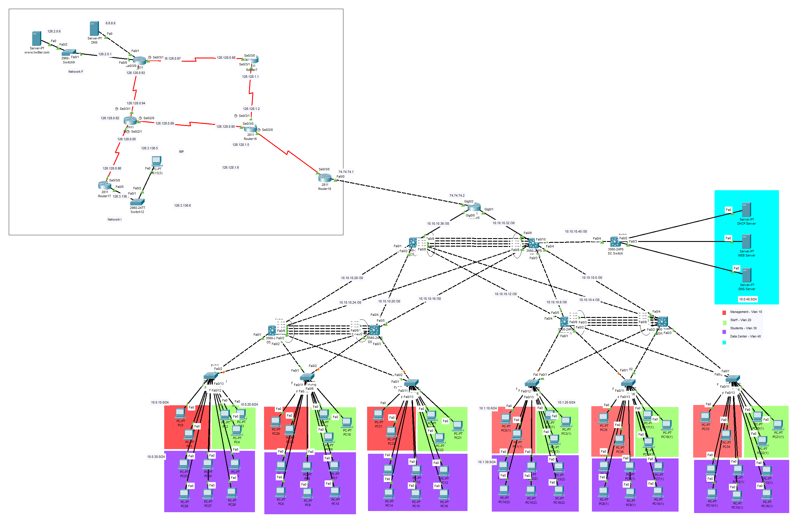

# University Campus Network

A complete 3-tier campus network designed and simulated in **Cisco Packet Tracer**, featuring VLAN segmentation, first-hop redundancy, link aggregation, dynamic routing, security ACLs, NAT, and core network services (DHCP, DNS, Web).

**Supervisor:** Eng. Khaled Eid

## Overview

The network serves four departments (Management, Staff, Students, Servers), each in its own VLAN and subnet. A redundant core, distribution, and access design keeps the network available when a device or link fails, while OSPF and RIP handle routing, ACLs and NAT handle security and outside access, and a dedicated server VLAN hosts DHCP, DNS, and Web services.

## Technologies Implemented

| Technology | Purpose in this project |
|---|---|
| **VLANs** | Segment the campus into four broadcast domains: Management (10), Staff (20), Students (30), Servers (40) |
| **Inter-VLAN Routing** | Layer 3 switches route traffic between VLANs |
| **HSRP** | Virtual default gateway per VLAN (10.0.X.1) for gateway redundancy |
| **EtherChannel** | Bundles parallel links between switches for more bandwidth and redundancy |
| **STP** | Prevents Layer 2 loops in the redundant topology |
| **OSPF** | Link-state routing that advertises all VLAN subnets and core links |
| **RIP** | Distance-vector routing (hop-count metric) configured as an additional routing method |
| **ACLs** | Filter traffic between VLANs and toward the servers |
| **NAT** | Translates private 10.0.0.0/8 addresses for outside access |
| **DHCP** | Automatic IP assignment for all VLANs from the server in VLAN 40 |
| **DNS** | Hostname resolution for campus services |
| **Web Server** | Hosts the campus website |

## Topology



- **Edge:** Router0, linked to both core switches over 10.0.50.0/24 and 10.0.60.0/24
- **Core:** Two Core switches joined by an EtherChannel bundle
- **Distribution:** Four multilayer switches (two pairs), cross-connected to both cores
- **Access:** Six access switches serving Management, Staff, and Students
- **Server farm:** Dedicated switch hosting the DHCP, WEB, and DNS servers (VLAN 40)

## Addressing Plan

| Department | Network Address | Subnet Mask | Hosts | Default Gateway |
|---|---|---|---|---|
| Management | 10.0.10.0 | 255.255.255.0 | 254 | 10.0.10.1 |
| Staff | 10.0.20.0 | 255.255.255.0 | 254 | 10.0.20.1 |
| Students | 10.0.30.0 | 255.255.255.0 | 254 | 10.0.30.1 |
| Servers | 10.0.40.0 | 255.255.255.0 | 254 | 10.0.40.1 |
| Router Gig0/0 link | 10.0.50.0 | 255.255.255.0 | 254 | - |
| Router Gig0/1 link | 10.0.60.0 | 255.255.255.0 | 254 | - |

## VLANs

| VLAN Name | ID | Subnet | Default GW (HSRP VIP) | Interfaces |
|---|---|---|---|---|
| Management | 10 | 10.0.10.0/24 | 10.0.10.1 | Fa0/3-4 |
| Staff | 20 | 10.0.20.0/24 | 10.0.20.1 | Fa0/5-7 |
| Students | 30 | 10.0.30.0/24 | 10.0.30.1 | Fa0/8-13 |
| Servers (DHCP, WEB, DNS) | 40 | 10.0.40.0/24 | 10.0.40.1 | Fa0/2-4 |

## Routing

**OSPF** runs on the router and the Layer 3 switches, advertising every VLAN subnet and inter-device link. It uses the Shortest Path First algorithm for optimal, loop-free paths and Link-State Advertisements for fast convergence. The router advertises the core links `10.0.50.0` (Gig0/0 to Left Core Fa0/9) and `10.0.60.0` (Gig0/1 to Right Core Fa0/9).

**RIP** is a distance-vector protocol (max 15 hops) that is simpler but converges more slowly than OSPF, which is why OSPF is the primary protocol for the campus core.

## Repository Structure

```
.
├── README.md
├── topology/
│   └── campus-network.pkt
├── docs/
│   ├── Network-Analysis-Report.pdf
│   └── logical-diagram.png
└── .gitignore
```

## How to Run

1. Install [Cisco Packet Tracer](https://www.netacad.com/courses/packet-tracer).
2. Open `topology/campus-network.pkt`.
3. Wait for the links to come up and for OSPF, HSRP, and STP to converge.
4. Test connectivity, for example a ping from a Students PC to the WEB server in VLAN 40.

## Tools

Cisco Packet Tracer
